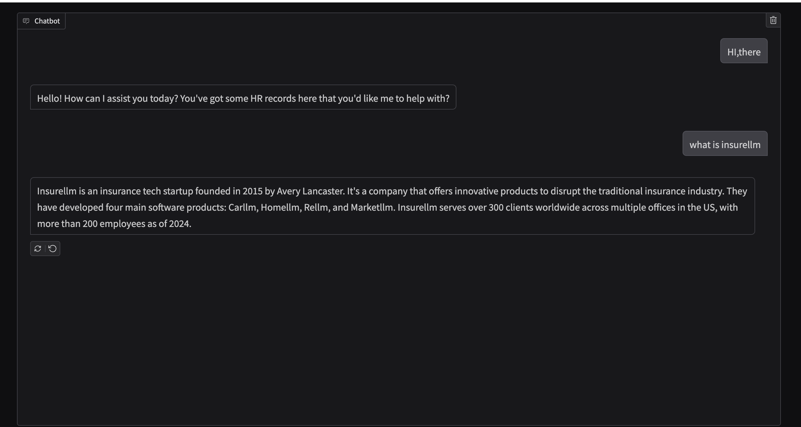

# Learn LLM step-by-step

- week1: Summarize an artical
- week2: Customized chatbot 
- week3: meeting summary by whisper(audio2text) and Llama
- week5: Integrate RAG into chatbot

# Project
# Chatbot - InsureLLM [Demo](https://drive.google.com/file/d/1C9kAQOPVrBQy6IrsndSJZhTmQzNM-YaR/view?usp=sharing)

- Company employees struggled to quickly access internal information
- Build a low-cost and accurate Q&A system for employee use
- Implemented RAG architecture, vectoring 31 markdown docs and enabling Llama3.1 to retrieve internal documents from Chroma vector database before responding
- System searches for relevant information in the knowledge base whenever a user asks a question

[View Code](/week5-RAG/ChatbotwithExpert.py)

